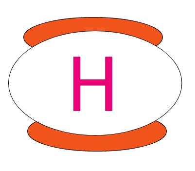

# Hupyter



I love writing tutorials in Jupyter Notebooks and I want to convert them to Hugo posts on [my blog](https://hongtaoh.com/). I tried [nb2hugo](https://github.com/vlunot/nb2hugo) by vlunot but it lacks two functions:
  1. It seems that if I've converted it before, then I have to delete the converted blog posts in `/content/` before I can convert again. 
  2. It does not update the image path automatically. I have to manually update the image path. 

These two deficiencies are pretty annoying because sometimes I need to modify my Jupyter notebooks and convert anew. Every time I convert, I have to delete the original blog post and manually change the image path. 

I cannot bear it anymore so I wrote my own program to do the job. This, in fact, is not difficult at all! It only contains fewer than 60 lines in Python. The heaviest part has already been done by [nbconvert](https://github.com/jupyter/nbconvert), which is based on [pandoc](https://pandoc.org/).

## What `hupyter.py` does:
  - Solve mathjax problems. For detailes, see [here](https://hongtaoh.com/en/2022/05/11/obsedian-mathjax-hugo-convert/).
  - Move the auto-generated files by [nbconvert](https://github.com/jupyter/nbconvert) to the `static` folder.
  - Update image links in the output markdown file. 

## Works for IJulia as well

`hupyter.py` works for IJulia. Use it the same way as you convert a `python` notebook. The only difference is that because Julia Plots were originally in `svg`, you need to save the figure in `png` or `jpg` and then embed the image in a markdown cell. For example:

```julia
using Plots

times = [0.1, 0.2, 0.3, 0.4, 0.5, 0.6] 
pix = [0.5, 1, 1.5, 2.5, 3.5, 5]
Plots.plot(times, pix
)
savefig("juliaplots/p1.png")
```

Adn then in a markdown cell:

```

```

After this is done, follow the instructions below as you are converting a normal `python` notebook. 

## How to use `hupyter.py`

Copy the `hupyter.py` file and paste it to the root folder of your Hugo project. Then, at the root directory of your hugo project, run

```bash
python hupyter.py notebook_directory post_direction
```

For example, if you have a folder called `notebooks` at the root directory of your Hugo project:

```bash
python hupyter.py notebooks/2022-08-24-hierarchical-clustering.ipynb en/blog
```

Please refer to [my Hugo project structure](https://github.com/hongtaoh/hongtaoh.github.io) to contextualize the command.

## Note

In the folder containing your notebook, for example, `notebooks`, if you have a subfolder containing images that you will use in `ipynb` files, you can name that subfolder anything but don't have the string of `files` in the name. This is because `nbconvert` will automatically generate a folder whose name contains the string of `files`. So if your image folder's name contains this string, bugs will occur. 

